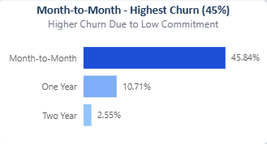
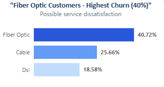
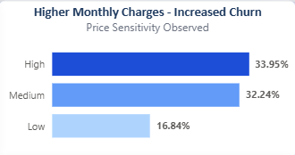
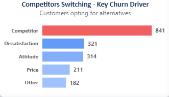
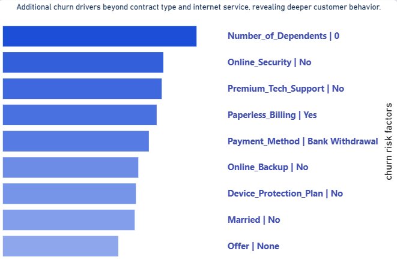

# Telecom-Customer-Churn-Analysis
End-to-end customer churn analysis using SQL, Python, and Power BI to identify key factors and reduce customer loss.

# 📊 Customer Churn Analysis

### 📌 Problem Statement

The telecom company is facing a churn rate of **26.5%**, with **1,869 customers lost**, resulting in an estimated revenue loss of **$139,000**.

However, the key drivers behind this churn are not clearly understood. This project aims to analyze customer data to identify the main factors influencing churn and provide actionable insights to improve customer retention.

## 📌 Project Overview

This project focuses on analyzing customer churn behavior in a telecom company. The goal is to identify key factors influencing customer churn and provide actionable insights to reduce customer loss.

---

## 🎯 Objectives

* Analyze customer data to identify churn patterns
* Identified key churn drivers by segmenting customers based on contract type, tenure, and monthly charges
* Identify high-risk customer segments
* Provide data-driven recommendations

---

## 🛠️ Tools & Technologies

* Python 🐍 (Pandas Basic) - Data Cleaning and EDA
* SQL 🗄️ - Data extraction, transformation, and EDA  
* Power BI 📊 - Interactive data visualization and dashboard creation
* Excel 📑 - Initial data exploration and validation

---

## 📂 Dataset

- Telecom Customer Churn dataset with structured customer-level data

- The dataset contains customer-level information from a telecom company, used to analyze churn behavior.

   - Total Records (Rows): 7,043
   - Total Features (Columns): 21
   - Target Variable: Churn (Yes/No)

- Data categories:
  - Customer Demographics  
  - Account & Subscription Information  
  - Service Usage Behavior  
  - Billing & Churn Details
    
---

## 🔍 Key Analysis Performed

- Contract Type vs Churn  
- Internet Service vs Churn  
- Monthly Charges Impact  
- Tenure Analysis  
- Age Group Analysis  
- Churn Reasons  
- Secondary Factors  
- Service Usage Impact  

---

## 📈 Key Insights & visualization

* Churn by Contract Type
  
 
  
Insight:- Customers on monthly plans are more likely to churn due to lower commitment compared to long-term contracts.

* Customer Churn Across Internet Service Types

 

 Insight:- Higher churn observed among Fiber Optic customers suggests possible dissatisfaction with service quality. 
 

  
  
* Impact of Monthly Charges on Customer Churn

Insight:- This suggests that pricing may influence customer retention.

* Churn by Age group

Insight:- Higher churn observed among senior customers, indicating potential service dissatisfaction within this segment.

* Reasons for Customer Churn

Insight:- Churn is primarily driven by competitors, while attitude-related issues and dissatisfaction also contribute significantly.

* Churn Trends Across Customer Tenure

Insight:- Higher churn in the first 6 months suggests that early customer experience plays a critical role in retention.

* Additional Drivers of Customer Churn

Insight:- Beyond primary drivers, churn is also influenced by lack of value-added services (security, support, backup), absence of offers, and payment-related friction.
  

---

## 💡 Recommendations

- Promote long-term contracts and introduce mid-term plans with added benefits to improve retention. 
- Improve onboarding and early-stage customer experience through priority support and targeted engagement. 
- Enhance fiber optic service quality through monitoring and customer feedback.
- Promote alternative payment methods (e.g., credit card, auto-pay) with incentives.
- Improve offer visibility through better UI/UX and targeted communication. 
- Promote bundled streaming services to increase engagement and switching costs.

---

## 📊 Dashboard

👉 Power BI dashboard provides interactive insights into customer churn trends

---

## 🚀 Project Outcome

This analysis helps businesses understand customer behavior and take proactive steps to reduce churn, improving customer retention and revenue.

---

## 🔗 Connect with Me

* LinkedIn: https://www.linkedin.com/in/hempreet-singh-8543b4247
* GitHub: https://github.com/hempreetsingh21122-rgb

---

⭐ If you found this project useful, consider giving it a star!

