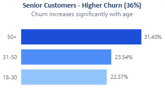

# Telecom-Customer-Churn-Analysis
End-to-end customer churn analysis using SQL, Python, and Power BI to identify key factors and reduce customer loss.

# 📊 Customer Churn Analysis

## 📌 Project Overview

This project focuses on analyzing customer churn behavior in a telecom company. The goal is to identify key factors influencing customer churn and provide actionable insights to reduce customer loss.

---

## 🎯 Objectives

* Analyze customer data to identify churn patterns
* Identified key churn drivers by segmenting customers based on contract type, tenure, and monthly charges
* Identify high-risk customer segments
* Provide data-driven recommendations

---

## 🛠️ Tools & Technologies

* Python 🐍 (Pandas Basic) - Data Cleaning and EDA
* SQL 🗄️ - Data extraction, transformation, and EDA  
* Power BI 📊 - Interactive data visualization and dashboard creation
* Excel 📑 - Initial data exploration and validation

---

## 📂 Dataset

- Telecom Customer Churn dataset with structured customer-level data  

- Data categories:
  - Customer Demographics  
  - Account & Subscription Information  
  - Service Usage Behavior  
  - Billing & Churn Details
    
---

## 🔍 Key Analysis Performed

* Churn rate analysis
* Contract type vs churn
* Monthly charges impact
* Tenure distribution
* Customer segmentation

---

## 📈 Key Insights & visualization

* Churn by Contract Type
  
 
  
Insight:- Customers on monthly plans are more likely to churn due to lower commitment compared to long-term contracts.

* Customer Churn Across Internet Service Types

 

 Insight:- Higher churn observed among Fiber Optic customers suggests possible dissatisfaction with service quality. 

  
  
* Impact of Monthly Charges on Customer Churn

Insight:- This suggests that pricing may influence customer retention.

* Churn by Age group

Insight:- Higher churn observed among senior customers, indicating potential service dissatisfaction within this segment.

* Reasons for Customer Churn

Insight:- Churn is primarily driven by competitors, while attitude-related issues and dissatisfaction also contribute significantly.

* Churn Trends Across Customer Tenure

Insight:- Higher churn in the first 6 months suggests that early customer experience plays a critical role in retention.

Insight:- 

* Other Contributing Factors to Churn

  

---

## 💡 Recommendations

* Encourage long-term contracts with incentives
* Provide better pricing strategies for high-paying customers
* Improve onboarding experience for new customers
* Target high-risk customers with retention offers

---

## 📊 Dashboard

👉 Power BI dashboard provides interactive insights into customer churn trends

---

## 🚀 Project Outcome

This analysis helps businesses understand customer behavior and take proactive steps to reduce churn, improving customer retention and revenue.

---

## 🔗 Connect with Me

* LinkedIn: https://www.linkedin.com/in/hempreet-singh-8543b4247
* GitHub: https://github.com/hempreetsingh21122-rgb

---

⭐ If you found this project useful, consider giving it a star!

