# 📊 SQL Analysis – Customer Churn

This section includes SQL queries used to analyze customer churn and derive key insights.

---

## 🧱 Base View Creation

To streamline analysis and avoid repetitive transformations, a base view was created with derived features and categorized variables.

```sql
DROP VIEW IF EXISTS customer_base;

CREATE VIEW customer_base AS
SELECT 
    *,
    
    -- Age Group Segmentation
    CASE 
        WHEN age > 50 THEN '50+'
        WHEN age BETWEEN 31 AND 50 THEN '31-50'
        ELSE '18-30' 
    END AS age_group,

    -- Service Usage Classification
    CASE 
        WHEN streaming_movies = 'Yes' AND streaming_music = 'Yes' AND streaming_tv = 'Yes' THEN 'Full_Usage'
        WHEN streaming_movies = 'No' AND streaming_music = 'No' AND streaming_tv = 'No' THEN 'No_Usage'
        WHEN streaming_movies IS NULL AND streaming_music IS NULL AND streaming_tv IS NULL THEN 'No_Internet_Service'
        ELSE 'Partial_Usage'
    END AS services_used,

    -- Tenure Grouping
    CASE 
        WHEN tenure_in_months <= 12 THEN '1-12'
        WHEN tenure_in_months <= 24 THEN '13-24'
        WHEN tenure_in_months <= 36 THEN '25-36'
        WHEN tenure_in_months <= 48 THEN '37-48'
        WHEN tenure_in_months <= 60 THEN '49-60'
        ELSE '61-72'
    END AS tenure_groups,

    -- Pricing Segmentation
    CASE 
        WHEN monthly_charges_revised < 60 THEN 'Low'
        WHEN monthly_charges_revised BETWEEN 60 AND 80 THEN 'Medium'
        ELSE 'High'
    END AS price_bucket,

    -- Marital Status
    CASE 
        WHEN married = 'True' THEN 'Married'
        ELSE 'Unmarried'
    END AS married_status

FROM customer_churn_data;
```

**Purpose:**
This view creates categorized features such as age groups, tenure segments, pricing buckets, and service usage levels, enabling efficient and reusable analysis across multiple queries.


## 🔍 Exploratory Data Analysis (EDA)

```sql
### 1. Customer Status Breakdown and Percentage Analysis

WITH total AS (
    SELECT COUNT(*) AS total_customers 
    FROM customer_churn_data
)
SELECT 
    customer_status,
    COUNT(*) AS customer_count,
    ROUND(COUNT(*) * 100.0 / t.total_customers, 2) AS percentage
FROM customer_churn_data, total t
GROUP BY customer_status, t.total_customers;
```
 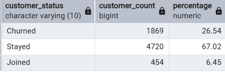

### 2. Churn Analysis by Contract Type
```sql

SELECT 
    contract,
    COUNT(*) AS total_customers,
    COUNT(*) FILTER (WHERE customer_status = 'Churned') AS churned_customers,
    ROUND(
        COUNT(*) FILTER (WHERE customer_status = 'Churned') * 100.0 / COUNT(*),             --- Percentage of customers churned
        2
    ) AS churn_percentage
FROM customer_churn_data
GROUP BY contract
ORDER BY churn_percentage DESC;
```
 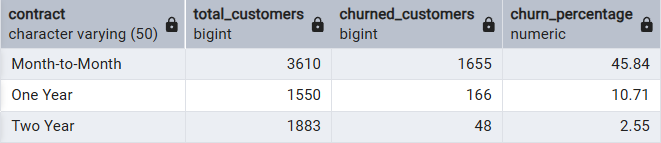

### 3. Churn Analysis by Internet Service
```sql

SELECT 
    internet_type,
    COUNT(*) AS total_customers,
    COUNT(*) FILTER (WHERE customer_status = 'Churned') AS churned_customers,
    ROUND(
        COUNT(*) FILTER (WHERE customer_status = 'Churned') * 100.0 / COUNT(*),
        2
    ) AS churn_percentage
FROM customer_base
GROUP BY internet_type
ORDER BY churn_percentage DESC;
```
 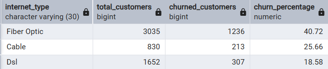

### 4. Pricing Segment Analysis (Price Bucket vs Churn)
```sql

SELECT 
    price_bucket,
    COUNT(*) AS total_customers,
    
    COUNT(*) FILTER (WHERE customer_status = 'Churned') AS churned_customers,    -- churned count
    
    ROUND(
        COUNT(*) FILTER (WHERE customer_status = 'Churned') * 100.0 / COUNT(*),   -- percentage of customers churned
        2
    ) AS churn_percentage

FROM customer_base
GROUP BY price_bucket
ORDER BY churn_percentage DESC;
```
 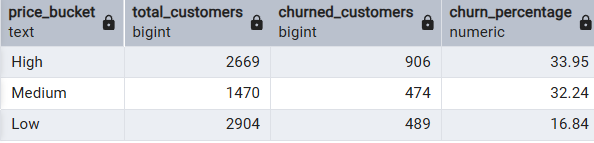

 ### 5. Pricing Impact on Churn
 ```sql

SELECT 
    contract,
    ROUND(
        AVG(monthly_charges_revised) FILTER (WHERE customer_status = 'Churned'),   --  churned_customers_monthly_charges
        2
    ) AS avg_churned_charges,
    ROUND(
        AVG(monthly_charges_revised) FILTER (WHERE customer_status = 'Stayed'),    --   active_customers_monthly_charges
        2
    ) AS avg_active_charges
FROM customer_base
GROUP BY contract
ORDER BY contract;
```
 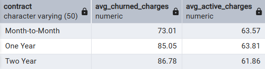


### 6. Age Group Churn Analysis
```sql

SELECT 
    age_group,
    COUNT(*) AS total_customers,
    
    COUNT(*) FILTER (WHERE customer_status = 'Churned') AS churned_customers,
    
    ROUND(
        COUNT(*) FILTER (WHERE customer_status = 'Churned') * 100.0 / COUNT(*),                   -- percentage of customers churned
        2
    ) AS churn_percentage,
    
    ROUND(
        SUM(monthly_charges_revised) FILTER (WHERE customer_status = 'Churned'),
        2
    ) AS revenue_lost

FROM customer_base
GROUP BY age_group
ORDER BY churn_percentage DESC;
```
 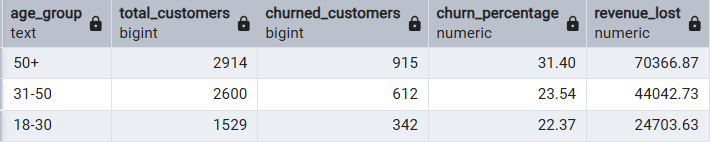

### 7. Churn Reason Analysis
```sql

SELECT 
    churn_category,
    
    COUNT(*) FILTER (WHERE customer_status = 'Churned') AS churned_customers,
    
    ROUND(
        COUNT(*) FILTER (WHERE customer_status = 'Churned') * 100.0 
        / SUM(COUNT(*) FILTER (WHERE customer_status = 'Churned')) OVER (),
        2
    ) AS contribution_percentage

FROM customer_base
GROUP BY churn_category
ORDER BY churned_customers DESC;
```
 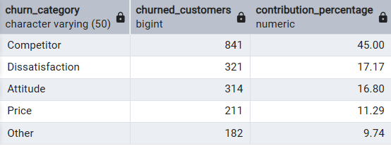

### 8. Tenure-Based Churn Analysis
```sql

SELECT 
    tenure_groups,
    
    COUNT(*) AS total_customers,
    
    COUNT(*) FILTER (WHERE customer_status = 'Churned') AS churned_customers,
    
    ROUND(
        COUNT(*) FILTER (WHERE customer_status = 'Churned') * 100.0 / COUNT(*),
        2
    ) AS churn_percentage

FROM customer_base
GROUP BY tenure_groups
ORDER BY churn_percentage DESC;
```
 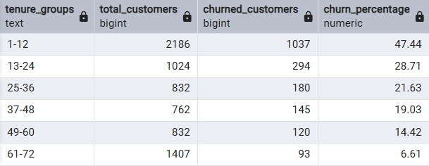

### Additional Contributing Factors
```

- **Service Gaps:** Lack of premium tech support, absence of online security, no online backup  
- **Customer Engagement:** Limited service usage, no offers used  
- **Billing & Payment:** Payment method and use of paperless billing  
- **Customer Profile:** Customers with no dependents and unmarried customers
```
#### Payment Method Impact on Churn
```sql

SELECT 
    payment_method,
    
    COUNT(*) AS total_customers,
    
    COUNT(*) FILTER (WHERE customer_status = 'Churned') AS churned_customers,
    
    ROUND(
        COUNT(*) FILTER (WHERE customer_status = 'Churned') * 100.0 / COUNT(*),
        2
    ) AS churn_percentage

FROM customer_base
GROUP BY payment_method
ORDER BY churn_percentage DESC;
```
 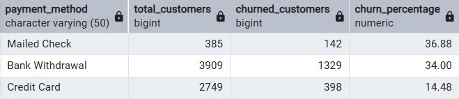

 #### Impact of Promotional Offers on Customer Churn
```sql

SELECT 
    offer,
    
    COUNT(*) AS total_customers,
    
    COUNT(*) FILTER (WHERE customer_status = 'Churned') AS churned_customers,
    
    ROUND(
        COUNT(*) FILTER (WHERE customer_status = 'Churned') * 100.0 / COUNT(*),
        2
    ) AS churn_percentage

FROM customer_base
GROUP BY offer
ORDER BY offer;
```
 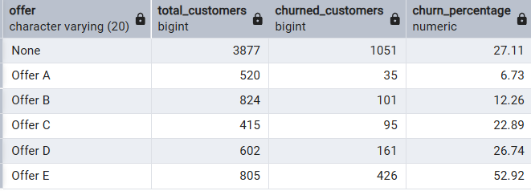


These factors also contribute to customer churn, although their impact is less significant compared to primary drivers.


### 8. Combined factor Analysis
```sql

### 3.2 Contract Distribution within Internet Service Types

SELECT 
    internet_type,
    contract,
    total_customers,
    SUM(total_customers) OVER (PARTITION BY internet_type) AS total_by_internet,             
    ROUND(
        total_customers * 100.0 / 
        SUM(total_customers) OVER (PARTITION BY internet_type),                       -- Customers Distribution
        2
    ) AS distribution_percentage
FROM (
    SELECT 
        internet_type,
        contract,
        COUNT(*) AS total_customers
    FROM customer_base
    GROUP BY internet_type, contract
) AS sub
ORDER BY internet_type, distribution_percentage DESC;
```
 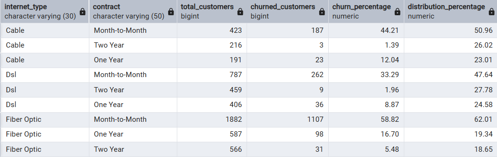
  
```sql

### 5.2. Age Group and Internet Service Interaction Analysis

SELECT 
    age_group,
    internet_type,
    
    churned_percent,
    
    ROUND(
        total_customers * 100.0 / 
        SUM(total_customers) OVER (PARTITION BY age_group),               -- Customers Distribution
        2
    ) AS distribution_percentage

FROM (
    SELECT 
        age_group,
        internet_type,
        
        COUNT(*) FILTER (WHERE customer_status = 'Churned') AS churned_customers,      
        COUNT(*) AS total_customers,
        
        ROUND(
            COUNT(*) FILTER (WHERE customer_status = 'Churned') * 100.0 / COUNT(*),      -- percentage of customers churned
            2
        ) AS churned_percent
        
    FROM customer_base
    GROUP BY age_group, internet_type
) AS sub

ORDER BY age_group, distribution_percentage DESC;
```
 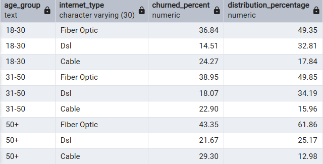

 ```sql

WITH cte AS(
SELECT internet_type, 
       payment_method, 
	   contract,
	   COUNT(*) Total_customers, 
	   COUNT(*) FILTER(WHERE customer_status = 'Churned') AS churned_customers
       FROM customer_base
       GROUP BY internet_type, 
	            payment_method,
				contract
       ORDER BY internet_type, 
                payment_method,
				contract
)
SELECT internet_type, 
       payment_method, 
	   contract,
	   churned_customers, 
	   Total_customers, 
       ROUND(churned_customers*100.0/Total_customers,2) AS churned_percent, 
       ROUND(total_customers*100.0/SUM(total_customers) OVER(PARTITION BY internet_type, payment_method),2) AS distribution_percent
	   FROM cte 
```
 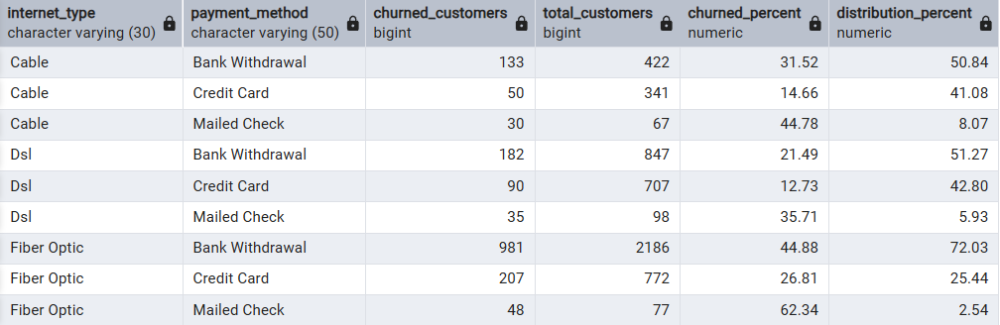


 ```sql


### 5.3. Age Group and Contract Type Interaction Analysis

SELECT 
    age_group,
    contract,
    
    churn_percentage,
    
    ROUND(
        total_customers * 100.0 / 
        SUM(total_customers) OVER (PARTITION BY age_group),                         -- Customer Distribution
        2
    ) AS distribution_percentage

FROM (
    SELECT 
        age_group,
        contract,
        
        COUNT(*) AS total_customers,
        
        ROUND(
            COUNT(*) FILTER (WHERE customer_status = 'Churned') * 100.0 / COUNT(*),                -- percentage of customers churned
            2
        ) AS churn_percentage
        
    FROM customer_base
    GROUP BY age_group, contract
) AS sub

ORDER BY age_group, distribution_percentage DESC;
```
 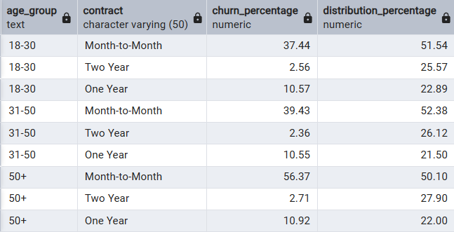


## 🔎 Advanced Analysis
```sql

### Multi-Factor Churn Contribution Analysis by Age Group

WITH base AS (
    SELECT 
        age_group,
        contract,
        internet_type,
        
        COUNT(*) AS total_customers,
        COUNT(*) FILTER (WHERE customer_status = 'Churned') AS churned_customers

    FROM customer_base
    GROUP BY age_group, contract, internet_type
)

SELECT 
    age_group,
    contract,
    internet_type,
    
    total_customers,
    churned_customers,

    -- Churn %
    ROUND(
        churned_customers * 100.0 / total_customers,
        2
    ) AS churn_percentage,

    -- Distribution within age + internet
    ROUND(
        total_customers * 100.0 /
        SUM(total_customers) OVER (PARTITION BY age_group, internet_type),
        2
    ) AS distribution_percentage

FROM base
ORDER BY age_group, internet_type, distribution_percentage DESC;


📌 Note: Only key queries are included here to highlight the most relevant insights. Additional exploratory queries were used during analysis but are not shown to maintain clarity.
---
